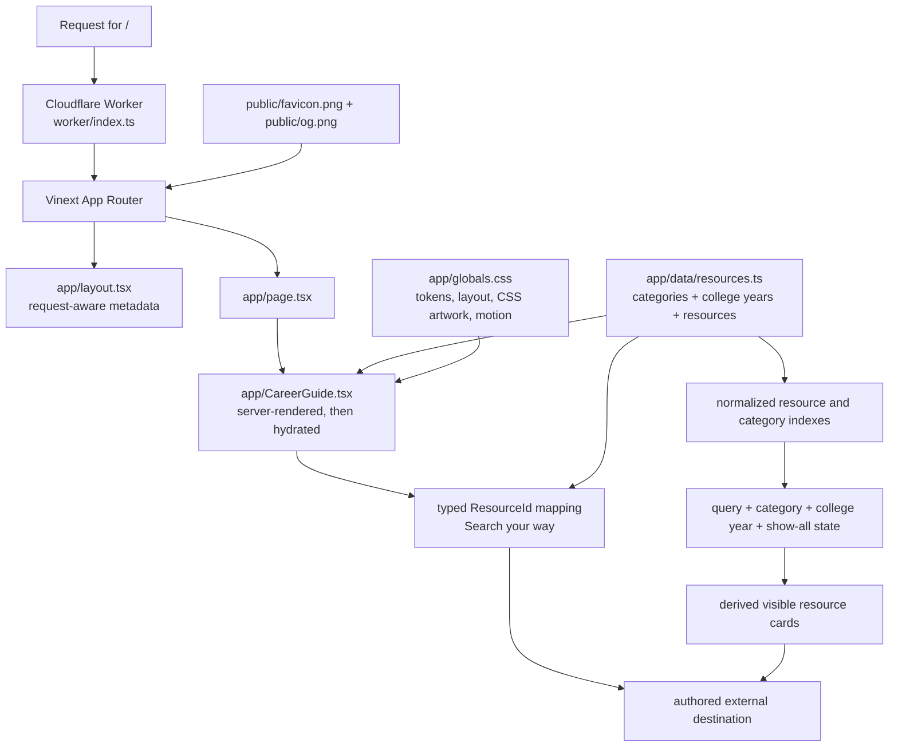
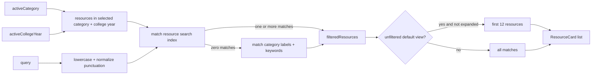

# Architecture

Where to Look is intentionally a small, stateless web application. Its authored resource catalog is compiled with the application, its initial page is rendered by a Cloudflare Worker through Vinext, and its few interactions run in one hydrated React client component.

This architecture fits the current product: editors maintain one curated dataset, visitors search it locally, and every opportunity remains on an external source. A database, resource API, and authentication layer would add operational complexity without serving a current requirement.

## System overview



The diagram shows two related flows: the request/render path and the in-browser resource-selection path. The data itself is not fetched at runtime.

## Runtime and build model

### Framework layers

- **Next.js App Router APIs** provide the `app/` conventions, metadata types, request headers, and page/layout model.
- **React 19** renders the page and hydrates client interactions.
- **Vinext** translates the Next-style application into the Vite and Cloudflare runtime used by this repository.
- **Vite** coordinates the build.
- **`@cloudflare/vite-plugin`** produces and runs the Cloudflare Worker environment.
- **The local Sites Vite plugin** copies `.openai/hosting.json` into the build artifact. It would also copy a root `drizzle/` directory if one existed; there is no such directory in the current application.

The npm commands in `package.json` invoke Vinext:

- `npm run dev` runs the local development environment;
- `npm run build` emits production files beneath `dist/`;
- `npm run start` serves an existing production build;
- `npm test` rebuilds, then tests the built Worker.

The current production artifact contains `dist/server/index.js` and `dist/client`. It is a Worker-rendered application with static client assets, not a Next static export. There is no `output: "export"` setting, no production `out/` directory, and no `dist/client/index.html` that could be deployed by itself.

### Worker entry point

`worker/index.ts` is the Worker entry point configured in `vite.config.ts`.

1. Requests to `/_vinext/image` are handled by Vinext's image optimizer using Cloudflare `ASSETS` and `IMAGES` bindings.
2. Every other request is delegated to `vinext/server/app-router-entry`.

The current page refers directly to the PNG favicon and social card and does not use a `next/image` component. The image route remains part of the starter-compatible runtime infrastructure.

### Hosting configuration

`.openai/hosting.json` contains an OpenAI Sites project ID and declares `d1` and `r2` as `null`. `vite.config.ts` can translate future logical D1 or R2 declarations into local Cloudflare bindings, but neither capability is active now. The built Wrangler configuration likewise contains no D1 database or R2 bucket binding.

See [DEPLOYMENT.md](DEPLOYMENT.md) for release instructions. Configuration presence alone does not establish which local revision, if any, is currently live.

## Routing and rendering

There is one user-facing route:

```text
app/layout.tsx
└── app/page.tsx  →  <CareerGuide />
```

- `app/layout.tsx` sets `lang="en"`, imports global CSS, declares the viewport/theme, and generates metadata.
- `generateMetadata()` reads `x-forwarded-host`, `host`, and `x-forwarded-proto` to construct an origin-appropriate `metadataBase` and absolute `/og.png` URL.
- `app/page.tsx` renders `CareerGuide` at `/`.
- `app/CareerGuide.tsx` starts with `"use client"`. Vinext still includes its initial content in server-rendered HTML, as the rendered-HTML test verifies; React then hydrates search, filtering, show-all, scrolling, and dialog behavior.
- Primary and footer navigation use fragment links such as `#categories` and `#resource-library`; they are not separate routes.

There are no API routes, middleware files, route parameters, authentication guards, or error/loading route components.

## Frontend component structure

The product intentionally keeps closely related UI in `app/CareerGuide.tsx` rather than distributing one page across a large component hierarchy.

| Unit | Role |
| --- | --- |
| `CareerGuide` | Owns client state and renders the complete page: header, hero, guidance, featured resources, career paths, college-year browsing, focused search-tool guidance, library, tips, about section, footer, and suggestion dialog. |
| `ResourceCard` | Renders both featured and regular resource records, including format, cadence, description, best-for content, tags, notes, and external action. |
| `SearchToolCard` | Renders a compact existing resource in “Search your way.” It receives a canonical `Resource` object resolved from the typed intent mapping rather than duplicating destination metadata. |
| `CategoryMark` | Maps controlled category icon names to CSS-styled text marks. |
| `Pinwheel` | Decorative, CSS-animated pinwheel with a configurable spin duration. |
| `Tree` | Decorative, CSS-animated tree. |

The remaining scene elements are local decorative spans. Keeping them with the page makes the CSS illustration relationship easy to follow; extraction is only useful if a component gains independent behavior or reuse.

## Resource data architecture

`app/data/resources.ts` is the authoritative content module. It exports:

- the ordered `categoryIds` tuple and `CategoryId` union;
- the `CategoryIcon` union and `CategoryMetadata` interface;
- the ordered `categories` array;
- `categoryById`, used for active-filter result copy;
- the five-value `collegeYearIds` tuple (`freshman`, `sophomore`, `junior`, `senior`, `new-grad`), its `CollegeYearId` union, the visible/audience metadata in `collegeYears`, and `collegeYearById`;
- the ordered `resourceIds` tuple and `ResourceId` union;
- controlled `ResourceFormat` and `ResourceTag` unions;
- the `Resource` interface;
- the ordered `resources` array;
- `featuredResources`, derived by filtering `featured === true`;
- `getResourcesByCategory()`, an exported helper not currently called by the page.

The data uses `readonly` contracts and `as const satisfies` to preserve literal values while checking record shape. `resourceIds` and the `resources` array are separately authored; the tests require them to contain the same IDs in the same order. A resource may have `recommendedForYears`, which means the destination is an especially useful starting point for those students; it does not assert job-level eligibility.

At present there are 13 categories and 64 resources. Underclassmen Opportunities is a non-featured Technology resource recommended for freshmen and sophomores; HiringCafe and Himalayas are non-featured General / Any Major resources. Counts shown in the hero, category cards, year controls, results copy, and show-all button are derived from the arrays rather than duplicated constants.

“Search your way” is intentionally outside the filter/state flow. `CareerGuide.tsx` builds a `Map<ResourceId, Resource>` from `resources`, and a small `searchToolIntents` constant references `handshake` and `himalayas` for work setup/location, then `hiringcafe` and `usajobs-early-careers` for compensation. This keeps identity, URL, description, format, and search aliases in the canonical dataset while allowing intent-specific headings and verified capability copy in the page. It does not expand the `Resource` interface or create a second resource inventory.

For schema and editorial rules, see [RESOURCE_GUIDE.md](RESOURCE_GUIDE.md).

## Search flow

Search is synchronous and entirely in memory.



### Index construction

Two maps are created once at module evaluation:

- the resource index combines a resource's `name`, `description`, `format`, `tags`, `bestFor`, and optional `searchTerms`;
- the category index combines `label`, `shortLabel`, and `keywords`.

Normalization lowercases text, replaces characters other than letters, numbers, `+`, `#`, and `/` with spaces, and trims the result.

### Matching rules

1. The active category and college year scope the available resources; an active year includes only records whose optional `recommendedForYears` contains that year.
2. An empty query returns that complete combined scope.
3. Nonempty queries try the resource index within that scope first.
4. Queries consisting of one or two alphanumeric characters use whole-token matching. This prevents `AI`, `IT`, `PR`, or `HR` from matching unrelated words that merely contain those letters.
5. Longer queries use normalized substring matching.
6. Only when there are zero direct resource matches does the search identify matching categories and return resources belonging to them within the same college-year scope.

The direct-match-first behavior is important. A specialist query such as “healthcare management” should surface relevant specialist destinations, not every Healthcare resource merely because the same phrase is a category keyword.

### State and derived output

`CareerGuide` has four pieces of state:

- `query: string`;
- `activeCategory: "all" | CategoryId`;
- `activeCollegeYear: "all" | CollegeYearId`;
- `showAllResources: boolean`.

`filteredResources` is memoized from `query`, `activeCategory`, and `activeCollegeYear`. Category and year scope are applied before the unchanged direct-resource/fallback-category query logic. `visibleResources` applies the default first-12 limit only when there is no query, active category, or active year. Changing the query or either filter resets `showAllResources`.

Selecting a large career-path or college-year card also scrolls to the library and focuses the search input. That scroll uses `auto` instead of `smooth` when the visitor prefers reduced motion.

The static “Search your way” section renders between college-year browsing and the library. Its cards are normal external anchors and do not read or update any of the four state values above.

## Persistence and backend boundaries

The application has no persistent visitor state:

- no `localStorage` or `sessionStorage`;
- no cookies set by application code;
- no account or authentication layer;
- no application database;
- no server mutation or form-submission endpoint;
- no job or resume storage.

The “Suggest a resource” footer button opens a native informational `dialog`. It does not collect or transmit a suggestion because no contact method is configured.

A backend is unnecessary because the current catalog changes through source review, every visitor receives the same records, filter state is temporary, and applications occur on external sites. Adding user-generated content, durable preferences, or submission review would require an explicit product and privacy decision before adding infrastructure.

## Styling and motion

`app/globals.css` is a single global, handwritten stylesheet. It contains:

- color, radius, shadow, and page-width custom properties;
- global reset and typography rules;
- all page-section and component classes;
- CSS-only scenery and category marks;
- responsive breakpoints at 1050, 820, and 580 pixels;
- animation keyframes and interaction transitions;
- a `prefers-reduced-motion: reduce` override;
- print-specific hiding and layout rules.

The body stack uses Avenir Next/Avenir with Segoe UI, Helvetica, and Arial fallbacks. Display headings use Georgia with Times New Roman and generic serif fallbacks. No webfont request is made.

Ambient animations use transforms or the individual transform properties: slow pinwheel spins, cloud/wind drift, a small target scale, path-dot movement, and tree sway. The reduced-motion media query disables smooth scrolling and forces animation and transition durations to `0.001ms` with one iteration. JavaScript scrolling also checks the media preference.

See [DESIGN_SYSTEM.md](DESIGN_SYSTEM.md) for the visual contract.

## External-link handling

Each resource action is a normal anchor to the authored HTTPS URL. It uses:

```html
target="_blank" rel="noopener noreferrer"
```

Its accessible name includes “opens in a new tab.” The application does not redirect, proxy, fetch, or reproduce destination content. Automated tests verify URL syntax, uniqueness, and safe rendered attributes, but URL relevance and liveness remain an editorial maintenance task.

## Accessibility structure

The page uses semantic landmarks and sections, a skip link, native controls, fieldset/legend filter grouping, explicit search labeling, `aria-pressed` filter state, and a polite atomic result status. Decorative scenes are hidden from assistive technology. Global visible focus styling and reduced-motion behavior apply across the page.

The design is responsive rather than route- or device-specific: grids collapse, navigation and filters become horizontally scrollable where needed, and actions become full-width on narrow screens. See [ACCESSIBILITY.md](ACCESSIBILITY.md) for testing expectations.

## Why the architecture stays simple

- The product's value is editorial curation and findability, not data transactions.
- One typed module is easier to review than a database-backed administration system for the current catalog size.
- Client-side search is immediate and inexpensive for 64 records.
- Derived views prevent counts and featured lists from drifting away from source data.
- Server-rendered initial HTML preserves content and metadata while one client component supplies the necessary interactivity.
- A stateless Worker keeps deployment compatible with the existing Sites/Vinext build without inventing storage needs.
- A concentrated page component and stylesheet make the unique illustrated design traceable without a premature abstraction layer.

Add architectural layers only when a confirmed requirement cannot be expressed safely within this model. Review [AI_CONTEXT.md](AI_CONTEXT.md) before proposing such a change.
